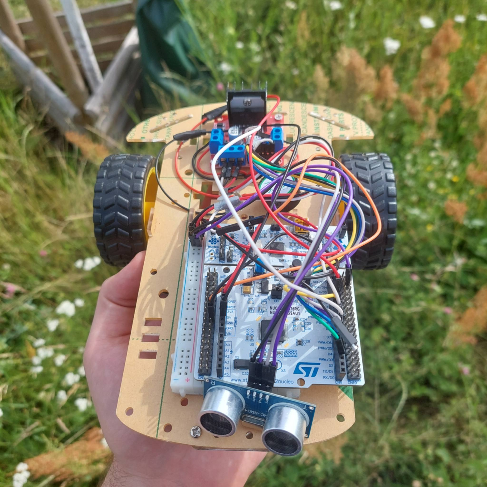

# STM32 Mobile Robot

Mobile robot control project developed for the **STM32L476RG** using **STM32CubeIDE** and the STM32 HAL library.

The application controls two DC motors, receives movement commands through UART, measures obstacle distance using an ultrasonic sensor, and provides distance feedback with the onboard LED.

## Features

- Two-motor drive control
- Forward, backward, left and right movement
- Adjustable motor speed using PWM
- UART-based remote control
- Ultrasonic distance measurement
- LED indication based on obstacle distance
- Status data transmitted through UART

## Robot Control

Movement commands are received through **USART2**.

| Command | Action |
|---|---|
| `F` | Move forward |
| `B` | Move backward |
| `L` | Turn left |
| `R` | Turn right |
| `0` | Set speed to 0 |
| `1` | Set speed to 200 |
| `2` | Set speed to 400 |
| `3` | Set speed to 600 |
| `4` | Set speed to 800 |
| `5` | Set speed to 1000 |

Motor direction is controlled using GPIO outputs, while motor speed is controlled with PWM signals generated by **TIM1** and **TIM2**.

## Distance Measurement

The ultrasonic sensor is handled using **TIM3** input capture.

The onboard LED indicates the measured distance:

- below approximately **6 cm** - LED constantly ON
- between approximately **6 cm and 150 cm** - LED blinks, with the interval depending on the measured distance
- above approximately **150 cm** - LED OFF

## UART Communication

The robot communicates through **USART2**. It receives movement and speed commands and transmits status information containing motor values, current direction, and obstacle detection state.

## Project Structure

```text
Core/        - main application and peripheral configuration
Drivers/     - STM32 HAL and CMSIS libraries
*.ioc        - STM32CubeMX project configuration
*.ld         - linker scripts for Flash and RAM
```

## Development Environment

The project was created for the **STM32L476RG** and developed using **STM32CubeIDE** with STM32 HAL drivers.

## Robot Prototype

<p align="center">
  
</p>
